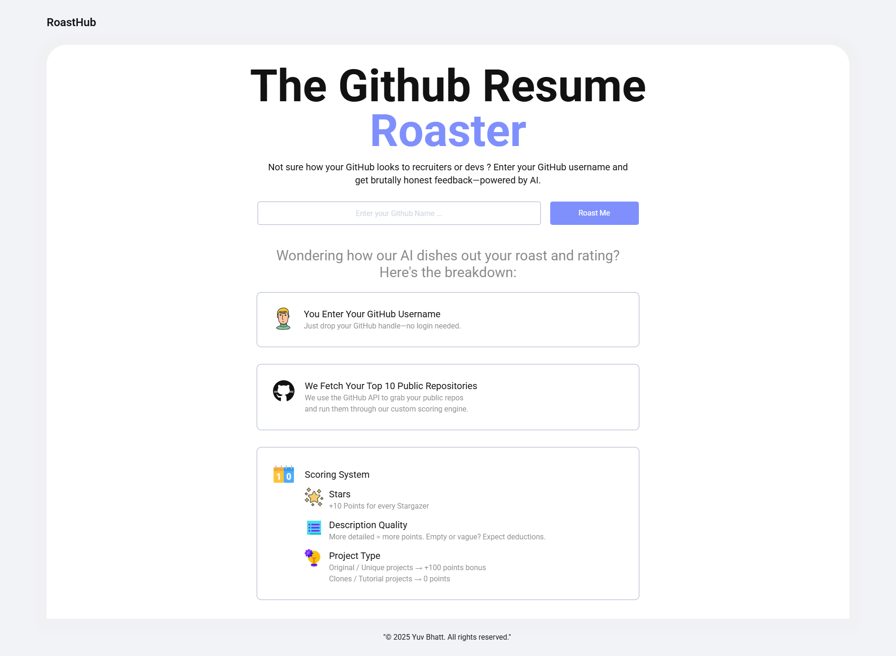
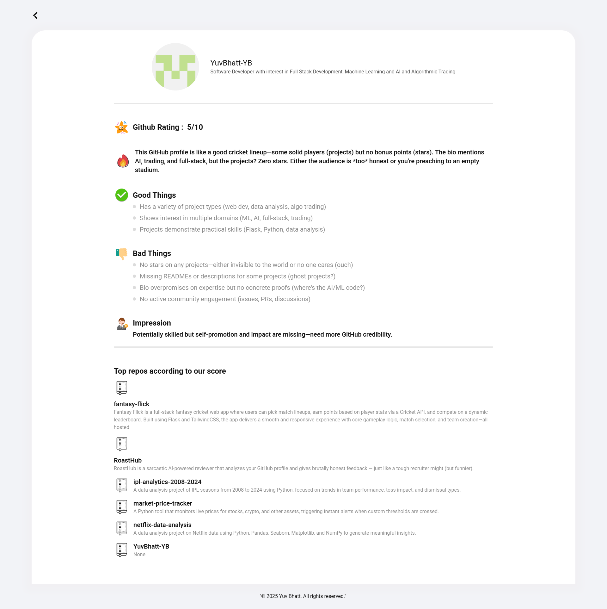
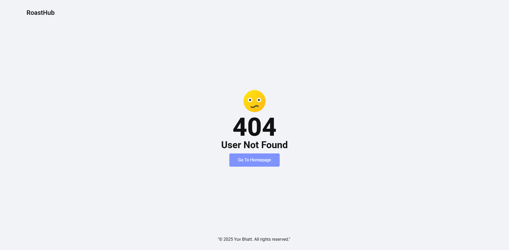

# 🔥 RoastHub — Roast Your GitHub with AI

Ever wondered what an AI recruiter *really* thinks of your GitHub profile?  
**RoastHub** analyzes your public repos, picks your top 10 projects, and generates a brutal (but constructive) roast — powered by open-source LLMs.

🟢 **Live Site:** [https://fantasyflick-05af.onrender.com/](https://fantasyflick-05af.onrender.com/)
🚀 **Hosted on:** [Render](https://render.com)  
⚠️ *Note: App is hosted on Render’s free tier. It may take 20–30 seconds to load if inactive.*

---

## 💡 Features

- 🧠 Analyzes your **top 10 GitHub projects** based on custom smart scoring
- 🔍 Detects **tutorial spam** and prioritizes original work
- 🤖 Uses **OpenRouter AI models** like `mistral-small` for free LLM feedback
- 🔥 Generates a **portfolio rating, roast, highlights, and recruiter POV**
- 📱 Clean, responsive UI (HTML + TailwindCSS)
- ✅ No login or signup — just drop your GitHub username

---

## 📷 Screenshots

> *Here’s a look at how Fantasy Flick works:*

**🏠 Homepage**  

**🔥💻🧠 Roast Page**  

**🪦💀 User Not Found Page**  

---

## 🎥 Demo

Check out a walkthrough of the app here:  

---

## ⚙️ Tech Stack

- 🔥 **Flask** — Python backend
- 💬 **OpenRouter API** — LLM calls (Mistral,etc.)
- 🎨 **TailwindCSS** — UI styling
- 🌐 **GitHub REST API** — For public profile + repo data

---
## 👨‍💻 Author

**Yuv**  
- 🌐 [GitHub](https://github.com/YuvBhatt-YB)  
- 💼 [LinkedIn](https://www.linkedin.com/in/yuv-bhatt/)  

---

## 📌 License

This project is for educational and portfolio purposes only.
